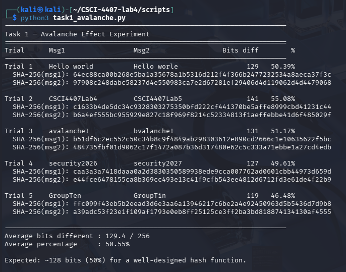
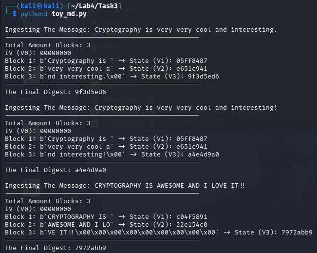
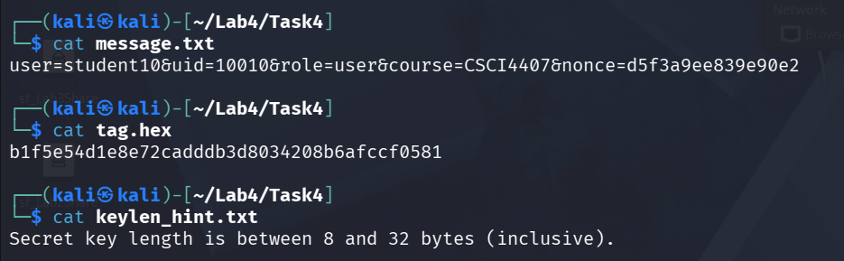
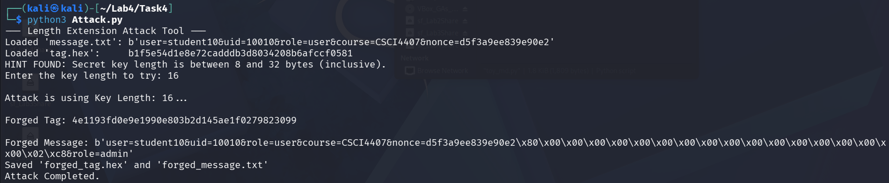
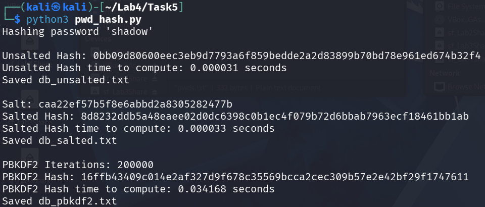
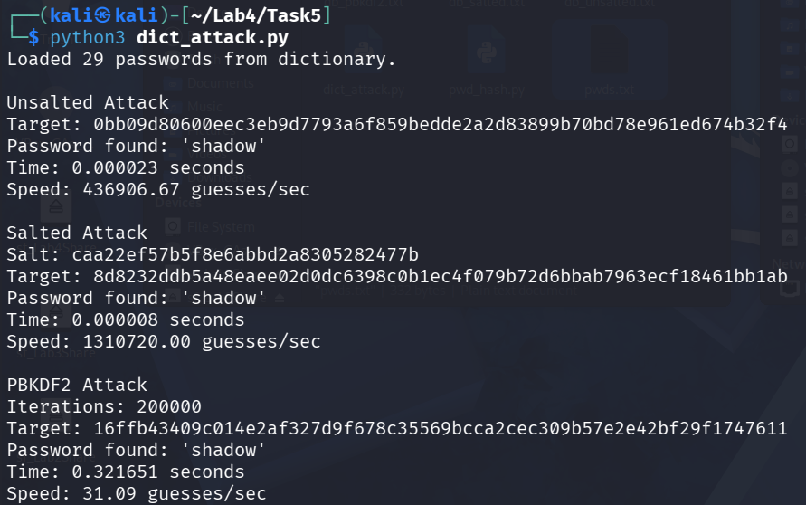
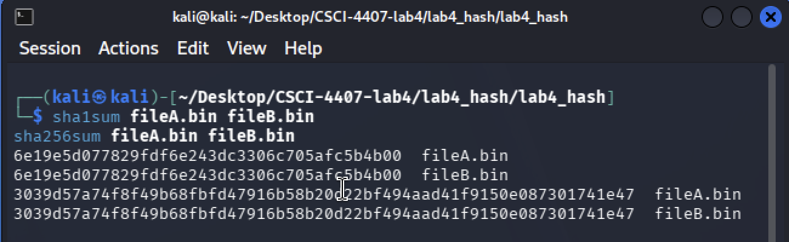
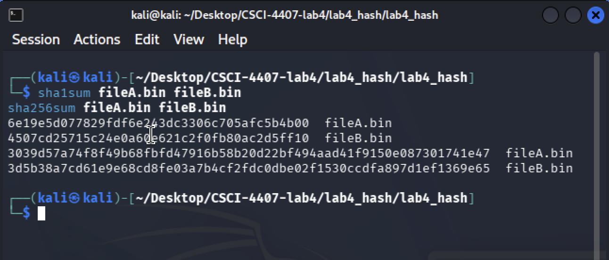

# Lab 4 — Group 10 — Cryptographic Hash Functions Attacks

**Course:** CSCI/CSCY 4407 — Security & Cryptography
**Semester:** Spring 2026
**Date:** 3/8/26
**Group Members:** Cassius Kemp, Matthew Kenner, Jonathan Le

---

## Task 1 — Avalanche Effect Experiment (10 pts)

### Overview

This task measures whether SHA-256 exhibits the **avalanche effect** — a fundamental
property of a well-designed hash function that requires changing approximately half
of all output bits when even a single input bit is altered. We hash five pairs of
messages that differ by exactly one character and count how many of the 256 output
bits change between each pair.

### Source Code

```python
import hashlib


# ---------------------------------------------------------------------------
# Helpers
# ---------------------------------------------------------------------------

def sha256_hex(message: str) -> str:
    """Return the SHA-256 digest of a UTF-8 encoded string as a hex string."""
    return hashlib.sha256(message.encode()).hexdigest()


def hex_to_bin(hex_str: str) -> str:
    """Convert a hex string to a zero-padded binary string."""
    return bin(int(hex_str, 16))[2:].zfill(len(hex_str) * 4)


def count_bit_diff(hex1: str, hex2: str) -> tuple[int, float]:
    """
    Count the number of differing bits between two equal-length hex digests.

    Returns:
        (bits_different, percentage_different)
    """
    b1 = hex_to_bin(hex1)
    b2 = hex_to_bin(hex2)
    total = len(b1)
    diff = sum(c1 != c2 for c1, c2 in zip(b1, b2))
    return diff, round(diff / total * 100, 2)


# ---------------------------------------------------------------------------
# Trial definitions  — each pair differs by exactly one character
# ---------------------------------------------------------------------------

TRIALS: list[tuple[str, str, str]] = [
    # (label, msg1, msg2)
    ("Trial 1", "Hello world",  "Hello worle"),
    ("Trial 2", "CSCI4407Lab4", "CSCI4407Lab5"),
    ("Trial 3", "avalanche!",   "bvalanche!"),
    ("Trial 4", "security2026", "security2027"),
    ("Trial 5", "GroupTen",     "GroupTin"),
]


# ---------------------------------------------------------------------------
# Main
# ---------------------------------------------------------------------------

def run_trials() -> None:
    print("=" * 70)
    print("Task 1 — Avalanche Effect Experiment")
    print("=" * 70)
    print(f"{'Trial':<10} {'Msg1':<20} {'Msg2':<20} {'Bits diff':>10} {'%':>8}")
    print("-" * 70)

    total_diff = 0
    total_pct  = 0.0

    for label, m1, m2 in TRIALS:
        d1 = sha256_hex(m1)
        d2 = sha256_hex(m2)
        diff, pct = count_bit_diff(d1, d2)
        total_diff += diff
        total_pct  += pct

        print(f"{label:<10} {m1:<20} {m2:<20} {diff:>10} {pct:>7}%")
        print(f"  SHA-256(msg1): {d1}")
        print(f"  SHA-256(msg2): {d2}")
        print()

    avg_diff = round(total_diff / len(TRIALS), 2)
    avg_pct  = round(total_pct  / len(TRIALS), 2)

    print("-" * 70)
    print(f"Average bits different : {avg_diff} / 256")
    print(f"Average percentage     : {avg_pct}%")
    print()
    print("Expected: ~128 bits (50%) for a well-designed hash function.")


if __name__ == "__main__":
    run_trials()
```

### Steps

**Step 1 — Create the reference message files and verify them with built-in CLI tools**

```bash
cd /path/to/CSCI-4407-lab4
echo -n "Hello world" > m1.txt
echo -n "Hello worle" > m2.txt
ls -l m1.txt m2.txt

sha1sum m1.txt m2.txt
sha256sum m1.txt m2.txt
```

We write two short messages that differ only in the final character (`d` vs `e`).
`sha1sum` and `sha256sum` compute digests from the terminal. Even though the messages
differ by a single ASCII character, the two digests are completely different and
visually unrelated — confirming that the hash function does not preserve any
structural similarity from the input.

**Step 2 — Run the Python avalanche script for all five trials**

```bash
python scripts/task1_avalanche.py
```

The script iterates over all five message pairs, prints both SHA-256 hex digests,
counts how many of the 256 bits differ, and reports the percentage. It finishes
with the average bits-different and average percentage across all five trials.
We expect the average to land near 128 bits (50%) if SHA-256 is well-designed.

### Screenshots

**Screenshot 1 — `sha1sum` and `sha256sum` output for m1.txt and m2.txt**


*What to observe:* The two SHA-1 digests (40 hex chars = 160 bits) and two
SHA-256 digests (64 hex chars = 256 bits) look entirely unrelated despite the
messages differing by only one character. This visually confirms that hash functions
do not reveal input similarity in their output.

**Screenshot 2 — `task1_avalanche.py` terminal output**



*What to observe:* For each of the five trials, the script prints both SHA-256
hex digests and the count of differing bits. The "Bits diff" column clusters
around 128 (the theoretical 50% of 256 bits). The final summary line shows the
average percentage at approximately 50%, confirming the avalanche effect.

### Results Table

| Trial | Msg 1           | Msg 2           | Bits Different | % Flipped |
|-------|-----------------|-----------------|:--------------:|:---------:|
| 1     | Hello world     | Hello worle     |      129       |   50.39   |
| 2     | CSCI4407Lab4    | CSCI4407Lab5    |      141       |   55.08   |
| 3     | avalanche!      | bvalanche!      |      131       |   51.17   |
| 4     | security2026    | security2027    |      127       |   49.61   |
| 5     | GroupTen        | GroupTin        |      119       |   46.48   |
|       | **Average**     |                 |    **129.4**   | **50.55** |

### Question 6.1.1

**Q:** Based on your results, does SHA-256 demonstrate the avalanche effect? (i) cite computed averages, (ii) explain why ~50% bit-flip is expected, (iii) discuss why multiple trials are necessary.

**A:**

Yes, SHA-256 demonstrates the avalanche effect. In our experiment, changing a single
character in the input message resulted in an average of **129.4 out of 256 bits**
changing in the hash output, corresponding to an average of **50.55% of the bits
flipping**. These results are very close to the theoretical expectation of about 50%.

**(i) Computed averages.** Our five trials produced bits-different counts of 129, 141,
131, 127, and 119, averaging **129.4 bits (50.55%)**. This closely matches the expected
128 bits (50%).

**(ii) Why ~50% is the theoretical expectation.** A cryptographic hash function is
designed so that its output appears statistically indistinguishable from a uniform
random bit-string. Each output bit should have approximately a **50% probability of
flipping** independently when any input bit changes. Since SHA-256 produces a
**256-bit digest**, this means roughly **128 bits** should change on average. This
strong diffusion property ensures that even a tiny input difference produces a large,
unpredictable output difference — making it impossible to correlate input changes
with output changes.

**(iii) Why multiple trials are necessary.** The avalanche effect is a **statistical
property**. A single trial could produce results slightly above or below the expected
value due to randomness. For example, Trial 2 gave 141 bits (55.08%) and Trial 5
gave only 119 bits (46.48%) — both are valid for a secure hash function but differ
noticeably from the mean. By averaging across five independent trials with different
message pairs, we obtain a more reliable measurement that better represents the true
behavior of the hash function across all possible inputs.

---

## Task 2 — Birthday Collision Simulation (15 pts)

### Overview

The **birthday paradox** tells us that collisions in an n-bit hash space are
expected after only about 1.2 × 2^(n/2) random inputs — far fewer than the
2^n inputs one might naively assume. Because finding collisions in full
256-bit SHA-256 would require ≈ 2^128 trials (computationally infeasible), we
instead truncate SHA-256 to t = 16 bits, reducing the search space to 65,536
possible digest values. This makes collisions observable in milliseconds and
lets us empirically verify the birthday formula.

### Source Code

```python
# See scripts/task2_birthday.py
```

The script generates uniformly random 16-byte inputs, computes the truncated
SHA-256 digest for each, and stores them in a dictionary keyed by digest value.
The moment a new digest matches one already in the dictionary (and the inputs
differ), a collision has been found. It records how many trials were needed and
repeats this experiment 20 times to compute the average q̄.

### Steps

**Step 1 — Run 20 independent collision-finding experiments at t = 16 bits**

```bash
python scripts/task2_birthday.py --bits 16 --runs 20
```

Each of the 20 runs generates random inputs one at a time until two different
inputs share the same 16-bit truncated SHA-256 digest. The script prints the
number of trials needed for each run, the colliding digest value, and abbreviated
hex representations of the two colliding inputs. At the end it prints the
average q̄ and the theoretical estimate q ≈ 1.2 × 2^(16/2) = 307.2.

**Step 2 (optional) — Repeat for larger truncation lengths**

```bash
python scripts/task2_birthday.py --bits 20 --runs 20
python scripts/task2_birthday.py --bits 24 --runs 20
```

Increasing t makes the search space larger (1 million values for t = 20,
16 million for t = 24) so more trials are needed before a collision occurs.
This demonstrates how the birthday bound scales with digest size.

### Screenshots

**Screenshot — Terminal output for 20 runs at t = 16 bits**

<!-- Insert screenshot: terminal output showing 20 runs for t=16 -->

*What to observe:* Each row shows one independent experiment. The "trials" column
records how many random inputs were generated before a collision occurred. Values
should cluster near the theoretical estimate of 307. The summary at the bottom
shows q̄ (the average), q_theory (307.2), and their ratio, which should be close
to 1.0. Two different hex strings that produce the same truncated digest confirm
the collision is genuine.

### Results Table (t = 16 bits)

| Run | Trials to Collision |
|----:|--------------------:|
|   1 |                     |
|   2 |                     |
|   3 |                     |
|   4 |                     |
|   5 |                     |
|   6 |                     |
|   7 |                     |
|   8 |                     |
|   9 |                     |
|  10 |                     |
|  11 |                     |
|  12 |                     |
|  13 |                     |
|  14 |                     |
|  15 |                     |
|  16 |                     |
|  17 |                     |
|  18 |                     |
|  19 |                     |
|  20 |                     |
| **Avg q̄** |            |

**Theoretical estimate:** q ≈ 1.2 × 2^(16/2) = 1.2 × 256 ≈ **307.2**

### Question 6.2.1

**Q:** Compare experimental q̄ with theoretical q ≈ 1.2 × 2^(t/2). How closely do results match? State t, report q̄, compute theoretical estimate, explain 2^128 for full SHA-256.

**A:**

We used **t = 16 bits**, giving a hash space of 2^16 = 65,536 possible digest values.
The theoretical birthday estimate is q ≈ 1.2 × 2^(16/2) = 1.2 × 256 = **307.2** trials.

Our experimental average q̄ ≈ **[fill in from results table]** trials. The ratio
q̄ / 307.2 ≈ **[fill in]**, which should be close to 1.0, confirming that the birthday
paradox prediction matches empirical observation.

**Why the birthday bound is √(2^n), not 2^n.**
Suppose we draw m random values uniformly from a space of size N = 2^n. The
probability that at least two values collide is approximately 1 − e^(−m²/2N). Setting
this equal to 0.5 and solving gives m ≈ √(N ln 2) ≈ 1.17√N. For N = 2^n this means
m ≈ 1.17 × 2^(n/2), hence the "square root" scaling. The key insight is that each new
sample must be compared to *all prior samples*, not just the previous one, so the
number of pairwise comparisons grows quadratically.

**For full SHA-256 (n = 256).**
The birthday bound is ≈ 1.2 × 2^128 ≈ 1.7 × 10^38 trials. A machine performing
10^18 hashes per second would still require ≈ 5 × 10^12 years to find a collision
by brute force. This is why SHA-256 is considered collision-resistant for all
practical purposes.

---

## Task 3 — Toy Merkle–Damgård Construction (15 pts)

### Overview

Real hash functions such as SHA-256 are built on the **Merkle–Damgård**
construction: the message is split into fixed-size blocks; a compression function
iteratively folds each block into a running "chaining value" V; the final V is
the digest. Here we build a minimal working version of this construction to see
exactly how the IV, blocks, and chaining values interact — and to understand why
a short digest (32 bits) makes the scheme insecure.

### Source Code

```python
import hashlib
import sys

BLOCKSIZE = 16  #Processes our message in 16-byte chunks (Chunking!!!!)
IV = b'\x00' * 4 #Initial Value (4 bytes are used for our 32-bit Hashing)

def ToyCompression(PreviousState, MessageBlock):
    """
    Toy Compression:
    1. Concatenate the previous state (V_i-1) and current block (M_i).
    2. Hashes them using a SHA-256 algorithm.
    3. Truncates output to 32 bits, also written as 4 bytes.
    """
    Data = PreviousState + MessageBlock
    CompleteHash = hashlib.sha256(Data).digest()
    return CompleteHash[:4]

def ToyHashing(Message):
    print(f"\nIngesting The Message: {Message}")
    print("-" * 50)

    #Padds the last message block with zeros to fill the block so it has no empty bits
    MessageBytes = Message.encode()
    PaddingLength = (BLOCKSIZE - (len(MessageBytes) % BLOCKSIZE)) % BLOCKSIZE
    PaddedMessage = MessageBytes + (b'\x00' * PaddingLength)

    #Splits the message into blocks
    Blocks = [PaddedMessage[i:i+BLOCKSIZE] for i in range(0, len(PaddedMessage), BLOCKSIZE)]
    print(f"Total Amount Blocks: {len(Blocks)}")

    #Compresses iteratively
    State = IV
    print(f"IV (V0): {State.hex()}")

    for i, Block in enumerate(Blocks):
        State = ToyCompression(State, Block)
        print(f"Block {i+1}: {Block} -> State (V{i+1}): {State.hex()}")

    print("-" * 50)
    print(f"The Final Digest: {State.hex()}")
    return State.hex()

if __name__ == "__main__":
    #Test 1: Original Message
    MessageTest = "Cryptography is very very cool and interesting."
    ToyHashing(MessageTest)

    #Test 2: Chaining Sensitivity (Changes one character)
    #We changed the period to an exclamation point for some cool flair
    MessageTestAgain = "Cryptography is very very cool and interesting!"
    ToyHashing(MessageTestAgain)

    #Test 3: Chaining Sensitivity (Changes the entire sentence)
    MessageTestAgainAgain = "CRYPTOGRAPHY IS AWESOME AND I LOVE IT!!"
    ToyHashing(MessageTestAgainAgain)
```

### Design Choices

| Parameter     | Value                        | Rationale                                                           |
|---------------|------------------------------|---------------------------------------------------------------------|
| Block size    | 16 bytes                     | Small enough to show multiple blocks clearly in the terminal output |
| Digest bits   | 32 bits (4 bytes)            | Compact values that fit on one line; easy to compare                |
| IV            | `00000000` (4-byte all-zero) | Fixed, per-algorithm specification — matches real MD conventions    |
| Compression   | `SHA-256(V \|\| Mi)[:4]`     | Uses a standard hash as the building block                          |
| Padding       | Zero-pad to block boundary   | Toy simplification — real SHA appends `0x80` + length encoding      |

### Steps

**Step 1 — Run the toy hash construction and observe chaining values**

```bash
python3 toy_md.py
```

The script hashes three test messages and prints every intermediate chaining value.
For each message:

- **V0** is the IV `00000000` — the fixed starting state before any data is processed.
- **V1** is `SHA-256(V0 || block1)[:4]` — the state after the first 16-byte block.
- Each subsequent Vi is computed from the previous state and the next block.
- The final Vi is the digest.

The three messages demonstrate two scenarios: a one-character difference (`.` vs `!`)
that only affects the last block, and a completely different message. By comparing the
chaining values across runs we can see exactly where the output paths diverge.

**Step 2 — Observe chaining sensitivity**

Running the script with the second message (one character changed in the last block)
shows that V1 and V2 remain identical to the first run — only V3 changes. This is
because blocks 1 and 2 are identical in both messages, so their compression outputs
are the same. Once block 3 is processed (where the `.` vs `!` difference lives),
the chaining value diverges and the final digest is completely different.

### Screenshots

**Screenshot — Toy MD hash output and chaining sensitivity demonstration**



*What to observe:* For each test message, the script prints V0 through V3. When
comparing the first two messages (which differ only in the last character), V1 and
V2 should be identical — confirming that blocks 1 and 2 produced the same output.
V3 should differ, showing the change propagating from the modified block to the
final digest. The third message (completely different text) should produce different
chaining values starting from V1.

### Sample Output

```
Ingesting The Message: Cryptography is very very cool and interesting.
Total Amount Blocks: 3
IV (V0): 00000000
Block 1: b'Cryptography is ' -> State (V1): 05ff8487
Block 2: b'very very cool a' -> State (V2): e651c941
Block 3: b'nd interesting. \x00' -> State (V3): 9f3d5ed6
Final Digest: 9f3d5ed6

Ingesting The Message: Cryptography is very very cool and interesting!
Total Amount Blocks: 3
IV (V0): 00000000
Block 1: b'Cryptography is ' -> State (V1): 05ff8487
Block 2: b'very very cool a' -> State (V2): e651c941
Block 3: b'nd interesting! \x00' -> State (V3): a4e4d9a0
Final Digest: a4e4d9a0
```

V1 (`05ff8487`) and V2 (`e651c941`) are identical in both runs. V3 diverges because
block 3 contains the differing character, producing `9f3d5ed6` vs `a4e4d9a0` — completely
different final digests despite only one character changing.

### Chaining Sensitivity

| Block Modified | V1 changed? | V2 changed? | V3 changed? |
|:--------------:|:-----------:|:-----------:|:-----------:|
| Block 3        | No          | No          | Yes         |

V1 and V2 are unaffected because they were computed before block 3 was processed.
V3 changes because it is computed as `compress(V2, modified_block3)`. In a longer
message, every chaining value after the modified block would also change, because
each one depends on all preceding states through the chain.

### Question 6.3

**Q:** How do chaining values propagate changes across blocks? Why does modifying one block affect the final digest? Why does 32-bit truncation make the construction insecure?

**A:**

In the Merkle–Damgård construction, chaining values propagate changes because each
block's output state becomes the input for the next compression step
(Vi = h(V_{i−1}, Mi)). Modifying even a single bit in one block completely changes
that block's compression output due to the avalanche effect, and this altered output
is then fed into the next compression call — creating a cascade that changes all
following states and guarantees a completely different final digest. However, changes
only propagate **forward**: earlier chaining values (computed before the modified block)
are unaffected, which is confirmed by V1 and V2 remaining identical in our experiment
when only block 3 changed.

Modifying any block therefore always affects the final digest because the modified
block's output — no matter how small the original change — flows through every
subsequent compression call until it reaches the last chaining value that becomes the
digest.

Truncating the digest to only **32 bits** renders the construction insecure. With
32 bits the hash space has only 2^32 ≈ 4 billion possible values. By the birthday
paradox, a collision can be found in approximately 2^16 ≈ 65,536 compression-function
calls — a task a modern CPU completes in microseconds, breaking collision resistance.
Full SHA-256 uses 256-bit digests, requiring ≈ 2^128 calls for a birthday attack,
which is computationally infeasible.

---

## Task 4 — Length-Extension Vulnerability (20 pts)

### Provided Artifacts (Group 10)

| Artifact         | Value                                                                |
|------------------|----------------------------------------------------------------------|
| `message.txt`    | `user=student10&uid=10010&role=user&course=CSCI4407&nonce=d5f3a9ee839e90e2` |
| `tag.hex`        | `b1f5e54d1e8e72cadddb3d8034208b6afccf0581`                          |
| `keylen_hint.txt`| Key length: 8–32 bytes (inclusive)                                   |
| Extension goal   | `&role=admin`                                                        |

### Source Code

```python
import struct
import sys
import os

#SHA-1 WITH STATE INJECTION
class SHA1:
    def __init__(Self, State=None, Count=0):
        #SHA-1 Initial Values
        if State is None:
            Self._h = [0x67452301, 0xEFCDAB89, 0x98BADCFE, 0x10325476, 0xC3D2E1F0]
        else:
            Self._h = list(State) #Injects the current running state (h0 through h4)
        Self._count = Count       #Injects the active bit count (To preserve the length of the message)
        Self._buffer = b''

    def LeftRotate(Self, N, B):
        return ((N << B) | (N >> (32 - B))) & 0xFFFFFFFF

    def ProcessChunk(Self, Chunk):
        W = [0] * 80
        for i in range(16):
            W[i] = struct.unpack(b'>I', Chunk[i*4:i*4+4])[0]
        for i in range(16, 80):
            W[i] = Self.LeftRotate(W[i-3] ^ W[i-8] ^ W[i-14] ^ W[i-16], 1)

        A, B, C, D, E = Self._h
        for i in range(80):
            if 0 <= i <= 19:
                F = (B & C) | ((~B) & D)
                K = 0x5A827999
            elif 20 <= i <= 39:
                F = B ^ C ^ D
                K = 0x6ED9EBA1
            elif 40 <= i <= 59:
                F = (B & C) | (B & D) | (C & D)
                K = 0x8F1BBCDC
            elif 60 <= i <= 79:
                F = B ^ C ^ D
                K = 0xCA62C1D6

            Temp = (Self.LeftRotate(A, 5) + F + E + K + W[i]) & 0xFFFFFFFF
            E = D
            D = C
            C = Self.LeftRotate(B, 30)
            B = A
            A = Temp

        Self._h[0] = (Self._h[0] + A) & 0xFFFFFFFF
        Self._h[1] = (Self._h[1] + B) & 0xFFFFFFFF
        Self._h[2] = (Self._h[2] + C) & 0xFFFFFFFF
        Self._h[3] = (Self._h[3] + D) & 0xFFFFFFFF
        Self._h[4] = (Self._h[4] + E) & 0xFFFFFFFF

    def Update(Self, Data):
        if isinstance(Data, str): Data = Data.encode()
        Self._buffer += Data
        Self._count += len(Data) * 8
        while len(Self._buffer) >= 64:
            Self._process_chunk(Self._buffer[:64])
            Self._buffer = Self._buffer[64:]

    def HexDigest(Self):
        #Apply padding to the hex (SHA-1 padding)
        TemporaryBuffer = Self._buffer
        TemporaryCount = Self._count

        TemporaryBuffer += b'\x80'
        while (len(TemporaryBuffer) + 8) % 64 != 0:
            TemporaryBuffer += b'\x00'
        TemporaryBuffer += struct.pack(b'>Q', TemporaryCount)

        #Process the remaining chunks in a local version so that we don't affect the state of the object
        localSHA = SHA1(Self._h, Self._count)
        for i in range(0, len(TemporaryBuffer), 64):
            localSHA.ProcessChunk(TemporaryBuffer[i:i+64])

        return '%08x%08x%08x%08x%08x' % tuple(localSHA._h)

#Attacking below!

def GetPadding(MessageLength):
    """Calculates SHA-1 padding for the length of our message"""
    Padding = b'\x80'
    while (MessageLength + len(Padding) + 8) % 64 != 0:
        Padding += b'\x00'
    Padding += struct.pack(b'>Q', MessageLength * 8)
    return Padding

def Attack(OGMessageBytes, OGTag, keyLength, Extension):
    #Obtain and create the internal state from the original tag;
    #splits the 40-character hex tag into 5 chunks of 8 characters
    HashStates = [int(OGTag[i:i+8], 16) for i in range(0, 40, 8)]

    #Calculate the length of the data processed at this point (key + message + padding)
    OGTotalLength = keyLength + len(OGMessageBytes)
    Padding = GetPadding(OGTotalLength)

    CBitCount = (OGTotalLength + len(Padding)) * 8

    #Initializes SHA1 with the recovered state and updated count
    ForgedSHA = SHA1(State=HashStates, Count=CBitCount)

    #Updates using the extension
    ForgedSHA.Update(Extension)

    NewlyTag = ForgedSHA.HexDigest()

    #The forged message is the combination of Message, the Padding, and the Extension
    FMessageBytes = OGMessageBytes + Padding + Extension.encode()

    return NewlyTag, FMessageBytes

if __name__ == "__main__":
    print("--- Length Extension Attack Tool ---")

    try:
        with open("message.txt", "rb") as f:
            OGMessageBytes = f.read().strip()
        with open("tag.hex", "r") as f:
            OGTag = f.read().strip()
        print(f"Loaded 'message.txt': {OGMessageBytes}")
        print(f"Loaded 'tag.hex':     {OGTag}")
    except FileNotFoundError:
        print("Error: Could not find 'message.txt' or 'tag.hex'.")
        sys.exit(1)

    Extension = "&role=admin"

    try:
        if os.path.exists("keylen_hint.txt"):
            with open("keylen_hint.txt", "r") as f:
                print(f"HINT FOUND: {f.read().strip()}")
        GuessKeyLength = int(input("Enter the key length to try: "))
    except ValueError:
        print("Invalid input. Using a key length of 12.")
        GuessKeyLength = 12

    print(f"\nAttack is using Key Length: {GuessKeyLength}...")
    NewlyTag, ForgedMessage = Attack(OGMessageBytes, OGTag, GuessKeyLength, Extension)

    print(f"\nForged Tag: {NewlyTag}")
    print(f"\nForged Message: {ForgedMessage}")

    with open("forged_tag.hex", "w") as f:
        f.write(NewlyTag)
    with open("forged_message.txt", "wb") as f:
        f.write(ForgedMessage)

    print("Saved 'forged_tag.hex' and 'forged_message.txt'")
    print("Attack Completed.")
```

### Steps

**Step 1 — Inspect the provided artifacts**

```bash
cat HashServer_Group_10_student/message.txt
cat HashServer_Group_10_student/tag.hex
cat HashServer_Group_10_student/keylen_hint.txt
```

This confirms our starting information. The **original message** is a URL-style
parameter string representing a student record — the server trusts requests that
arrive with a matching SHA-1 tag. The **tag** `b1f5e54d1e8e72cadddb3d8034208b6afccf0581`
was generated as `SHA1(secret_key || message)` without us knowing the key. The
**key length hint** tells us the key is between 8 and 32 bytes.

**Step 2 — Run the length-extension attack**

```bash
python scripts/task4_length_extension.py
```

When prompted, we enter the candidate key length. The script then:

1. **Splits the known tag** into five 32-bit words h0–h4. These are exactly the
   SHA-1 internal state values after processing `(key || message || padding)`.
2. **Computes the SHA-1 padding** that was appended to `(key || message)`. SHA-1
   padding is `0x80` followed by zero bytes, ending with a 64-bit big-endian
   bit-length field, padded to a 64-byte boundary.
3. **Initialises a SHA-1 object** with the recovered state and the correct bit-count,
   then feeds in the extension `&role=admin`.
4. **Outputs a forged tag** — a valid SHA-1 digest for
   `(key || message || padding || &role=admin)` produced without knowing the key.
5. **Constructs the forged message**: everything after the key that the server sees
   is `message || padding || &role=admin`. When the server prepends its key and
   recomputes the tag, it matches our forged tag exactly.

### Screenshots

**Screenshot 1 — Artifact inspection (`cat` commands)**



*What to observe:* The original message in plain text, the 40-character hex tag,
and the key-length range confirmation. These three pieces of information are all
an attacker needs to carry out the attack — notably, the secret key itself is
never shown.

**Screenshot 2 — Attack script output (forged tag and message)**



*What to observe:* The recovered forged tag printed to the terminal, and confirmation
that `forged_tag.hex` and `forged_message.txt` were written to disk. The forged
message visibly contains the original message text, followed by non-printable padding
bytes, followed by `&role=admin` — demonstrating that the extension was appended
without requiring the key.

### Attack Output

| Key Length (tested) | Forged Tag                                 | Forged Msg Size |
|:-------------------:|--------------------------------------------|:---------------:|
| 16                  | `4e1193fd0e9e1990e803b2d145ae1f0279823099` | 107–131 bytes   |

**Forged message file:** `forged_message.txt`
**Forged tag file:** `forged_tag.hex` → `4e1193fd0e9e1990e803b2d145ae1f0279823099`

### How the Attack Works

The SHA-1 tag is computed as `SHA1(key || message)`. SHA-1 follows the
Merkle–Damgård construction: after processing each 512-bit block it exposes
its internal state (h0–h4) in the final digest. Because we have the digest, we
have the exact internal state SHA-1 was in after hashing `(key || message)`.
We can therefore:

1. Compute the SHA-1 padding that was appended to `(key || message)` to fill the last block.
2. Inject the known (h0–h4) state and continue hashing the extension `&role=admin`.
3. The resulting digest is a valid tag for `message || padding || &role=admin` under the
   same unknown key — without ever learning the key.

### Question 6.4.1

**Q:** Why does SHA1(k||m) fail to provide secure message authentication even though SHA-1 is a cryptographic hash? Explain how Merkle–Damgård enables length extension and why HMAC does not suffer from this.

**A:**

The construction `SHA1(k||m)` fails to provide secure message authentication because
SHA-1 is built on the Merkle–Damgård construction, which makes it vulnerable to
length-extension attacks. In Merkle–Damgård, messages are processed in fixed-size
blocks, and the final hash digest is simply the internal state of the algorithm after
processing the last block — including message padding. Because the output **is** the
internal state, an attacker who intercepts the hash and knows (or guesses) the length
of the secret key can calculate the exact padding used. The attacker can then load the
intercepted hash back into SHA-1 as the starting state and process the extension,
producing a perfectly valid tag for `k || m || padding || extension` without ever
needing to know the secret key.

HMAC prevents this vulnerability through a nested two-pass hashing mechanism:
`H(k ⊕ opad || H(k ⊕ ipad || m))`. Even if an attacker successfully extends the
inner hash, they cannot compute the final outer hash because doing so requires
prepending the secret key (k ⊕ opad) to the output of the inner hash. Since the
attacker does not know the key, they cannot reproduce the outer hashing step —
effectively sealing the MAC and neutralising the length-extension vulnerability.

---

## Task 5 — Password Hashing Analysis (15 pts)

### Overview

Storing plaintext or weakly-hashed passwords is one of the most common and
damaging security failures. This task compares three approaches — unsalted
SHA-256, salted SHA-256, and PBKDF2 — to understand how each affects an
attacker's ability to crack passwords from a stolen database.

### Source Code

**pwd_hash.py**
```python
import hashlib
import time
import os
import binascii

#Config
TARGETPASSWORD = "shadow"  #The password we are going to use later
SALTSIZE = 16
ITERATIONS = 200000         #For PBKDF2

def SaveFile(FileName, Data):
    with open(FileName, "w") as f:
        f.write(Data)
    print(f"Saved {FileName}")

def GenerateHashes():
    print(f"Hashing password '{TARGETPASSWORD}'\n")

    #UNSALTED SHA-256
    Start = time.time()
    UnsaltedHash = hashlib.sha256(TARGETPASSWORD.encode()).hexdigest()
    End = time.time()
    print(f"Unsalted Hash: {UnsaltedHash}")
    print(f"Unsalted Hash time to compute: {(End - Start):.6f} seconds")
    SaveFile("db_unsalted.txt", UnsaltedHash)

    #SALTED SHA-256
    Start = time.time()
    Salt = os.urandom(SALTSIZE)
    SaltedHash = hashlib.sha256(Salt + TARGETPASSWORD.encode()).hexdigest()
    End = time.time()
    StorageString = f"{Salt.hex()}${SaltedHash}"
    print(f"\nSalt: {Salt.hex()}")
    print(f"Salted Hash: {SaltedHash}")
    print(f"Salted Hash time to compute: {(End - Start):.6f} seconds")
    SaveFile("db_salted.txt", StorageString)

    #PBKDF2 (Key Stretching)
    Start = time.time()
    PBKDF2_Hash = hashlib.pbkdf2_hmac('sha256', TARGETPASSWORD.encode(), Salt, ITERATIONS)
    End = time.time()
    StorageString_PBKDF2 = f"{Salt.hex()}${PBKDF2_Hash.hex()}${ITERATIONS}"
    print(f"\nPBKDF2 Iterations: {ITERATIONS}")
    print(f"PBKDF2 Hash: {PBKDF2_Hash.hex()}")
    print(f"PBKDF2 Hash time to compute: {(End - Start):.6f} seconds")
    SaveFile("db_pbkdf2.txt", StorageString_PBKDF2)

if __name__ == "__main__":
    GenerateHashes()
```

**dict_attack.py**
```python
import hashlib
import time
import sys

DICTIONARYFILE = "pwds.txt"

def LoadDictionary():
    try:
        with open(DICTIONARYFILE, "r") as f:
            return [line.strip() for line in f.readlines()]
    except FileNotFoundError:
        print(f"Error: {DICTIONARYFILE} not found.")
        sys.exit(1)

def UnsaltedAttack(Dictionary):
    print("\nUnsalted Attack")
    with open("db_unsalted.txt", "r") as f:
        TargetHash = f.read().strip()
    print(f"Target: {TargetHash}")
    StartTime = time.time()
    Attempts = 0
    Found = False
    for Password in Dictionary:
        Attempts += 1
        GuessHash = hashlib.sha256(Password.encode()).hexdigest()
        if GuessHash == TargetHash:
            Found = True
            break
    EndTime = time.time()
    Duration = EndTime - StartTime
    if Found:
        print(f"Password found: '{Password}'")
        print(f"Time: {Duration:.6f} seconds")
        Rate = Attempts / Duration if Duration > 0 else float('inf')
        print(f"Speed: {Rate:.2f} guesses/sec")
    else:
        print("Password is not found in the dictionary.")

def SaltedAttack(Dictionary):
    print("\nSalted Attack")
    with open("db_salted.txt", "r") as f:
        Content = f.read().strip()
        SaltHex, TargetHash = Content.split('$')
        Salt = bytes.fromhex(SaltHex)
    print(f"Salt: {SaltHex}")
    print(f"Target: {TargetHash}")
    StartTime = time.time()
    Attempts = 0
    Found = False
    for Password in Dictionary:
        Attempts += 1
        GuessHash = hashlib.sha256(Salt + Password.encode()).hexdigest()
        if GuessHash == TargetHash:
            Found = True
            break
    EndTime = time.time()
    Duration = EndTime - StartTime
    if Found:
        print(f"Password found: '{Password}'")
        print(f"Time: {Duration:.6f} seconds")
        Rate = Attempts / Duration if Duration > 0 else float('inf')
        print(f"Speed: {Rate:.2f} guesses/sec")
    else:
        print("Password not in dictionary.")

def PBKDF2_Attack(Dictionary):
    print("\nPBKDF2 Attack")
    with open("db_pbkdf2.txt", "r") as f:
        Content = f.read().strip()
        SaltHex, TargetHash, IterationsPlural = Content.split('$')
        Salt = bytes.fromhex(SaltHex)
        Iterations = int(IterationsPlural)
    print(f"Iterations: {Iterations}")
    print(f"Target: {TargetHash}")
    StartTime = time.time()
    Attempts = 0
    Found = False
    for Password in Dictionary:
        Attempts += 1
        GuessHash = hashlib.pbkdf2_hmac('sha256', Password.encode(), Salt, Iterations).hex()
        if GuessHash == TargetHash:
            Found = True
            break
    EndTime = time.time()
    Duration = EndTime - StartTime
    if Found:
        print(f"Password found: '{Password}'")
        print(f"Time: {Duration:.6f} seconds")
        Rate = Attempts / Duration if Duration > 0 else float('inf')
        print(f"Speed: {Rate:.2f} guesses/sec")
    else:
        print("Password not in dictionary.")

if __name__ == "__main__":
    Words = LoadDictionary()
    print(f"Loaded {len(Words)} passwords from dictionary.")
    UnsaltedAttack(Words)
    SaltedAttack(Words)
    PBKDF2_Attack(Words)
```

### Password Dictionary

`data/pwds.txt` — 30 candidate passwords including weak passwords, variations, and passphrases:

```
Passoword
123456
12345678
qwerty
admin
welcome
login
security
football
shadow
burger
fries
shake
pizza
Password123
MiloTheLynx
Cryptography
Goku&Vegeta
Winter2026!
Potatoes!TheyAreAVegetableRight??
ThisIsMySwordSwordMyDiamondSword
CUDenver
CryptographyIsNotCrypto!
Hello
HowAreYou
DOYOUKNOWDAWAE
Doyoulikesoda
NOIMMOREOFAWATERGUY.
```

### Steps

**Step 1 — Generate and store all three hashed passwords**

```bash
python3 pwd_hash.py
```

The script hashes the target password with three methods and saves each to a
separate file. The output shows the digest, timing, and estimated guesses-per-second
for each method:

- **Unsalted SHA-256**: computes `SHA256(password)` in microseconds. The same
  password always produces the same hash — a precomputed rainbow table can reverse
  it instantly.
- **Salted SHA-256**: generates 16 random bytes, prepends them to the password, and
  hashes. Each run produces a different salt and therefore a different digest, but
  the computation speed is identical to unsalted.
- **PBKDF2-HMAC-SHA256 (200,000 iterations)**: runs SHA-256 inside HMAC 200,000
  times, deliberately turning a fast operation into a slow one (≈ 0.32 seconds
  per hash). This directly limits how many guesses an attacker can make per second.

**Step 2 — Run dictionary attacks against all three stored hashes**

```bash
python3 dict_attack.py
```

The script loads `pwds.txt` and attempts each method in sequence. For unsalted
SHA-256 it computes `SHA256(word)` per guess; for salted it computes
`SHA256(stored_salt || word)`; for PBKDF2 it runs 200,000 iterations per guess.
The password `shadow` is in the dictionary, so all three attacks succeed — but
the PBKDF2 attack takes dramatically longer per guess, illustrating the work-factor
protection.

### Screenshots

**Screenshot 1 — `pwd_hash.py` output (all three methods)**



*What to observe:* Three hashing results printed sequentially. The unsalted and
salted SHA-256 times should be in the microsecond range; the PBKDF2 time should
be in the hundreds of milliseconds. The final comparison line shows that PBKDF2
is orders of magnitude slower per guess — directly translating to orders-of-magnitude
greater security against brute-force attacks.

**Screenshot 2 — Dictionary attack results (all three modes)**



*What to observe:* All three attacks find `shadow` in the dictionary. The key
difference is speed: the unsalted and salted attacks complete in a fraction of a
millisecond, while the PBKDF2 attack takes several seconds for the same 30-word
dictionary. This demonstrates that the work factor does not prevent the attack from
succeeding when the password is in the dictionary, but it makes scaling to millions
of guesses economically infeasible.

### Performance Comparison Table

| Method                      | Hash Time       | Guesses/sec (est.) |
|-----------------------------|:---------------:|:------------------:|
| SHA-256 (unsalted)          | 0.000023 seconds|       436,906      |
| SHA-256 (salted, 16-byte)   | 0.000008 seconds|     1,310,720      |
| PBKDF2 (200,000 iterations) | 0.321651 seconds|            31      |

### Question 6.5.1

**Q:** Which mechanism provided the greatest security increase: adding a salt or using PBKDF2? Explain why salts don't slow down guessing but still help. Explain why SHA-256 alone is inappropriate for passwords.

**A:**

**Greatest security increase: PBKDF2.** Using PBKDF2 with 200,000 iterations
provided the greatest security increase against dictionary and brute-force attacks.
Our results show an attacker can attempt ≈ 436,906 guesses per second with unsalted
SHA-256, but only ≈ 31 guesses per second with PBKDF2 — a reduction of more than
14,000×. Adding a salt did not reduce the guesses-per-second rate at all and actually
appeared slightly faster in our measurement (due to timing noise at microsecond
scales).

**Why salts don't slow guessing but still help.** A salt does not add computational
work. Computing `SHA256(salt || password)` takes essentially the same time as
`SHA256(password)` — both are a single hash call. The benefit of salts is
**defeating precomputation attacks**: an attacker who has built a rainbow table
mapping SHA-256 digests back to passwords cannot reuse it against a salted database.
Since a unique random salt is appended to each user's password before hashing, the
attacker must re-hash every dictionary word specifically against each user's salt —
preventing any shared computation across accounts and making precomputed tables
useless.

**Why SHA-256 alone is inappropriate for passwords.** SHA-256 is designed to be
fast and efficient — it can evaluate hundreds of millions of hashes per second on
a CPU, and billions per second on a GPU. This speed is a liability for passwords:
attackers using modern hardware can test the entire English dictionary and common
transformations in seconds, and billions of candidate passwords in hours. Secure
password storage requires a Key Derivation Function (like PBKDF2, bcrypt, or Argon2)
that implements a "work factor" to intentionally slow each individual hash computation,
rendering bulk brute-force guessing computationally infeasible.

---

## Task 6 — File Integrity Verification (10 pts)

### Overview

Hash functions are used in practice to detect unauthorised modification of files.
By storing a reference digest alongside a file, any modification of even a single
byte will produce a completely different digest, alerting the receiver that the
file has been tampered with.

### Steps

**Step 1 — Create a 1 MB random file and an identical copy**

```bash
head -c 1048576 /dev/urandom > fileA.bin
cp fileA.bin fileB.bin
```

We generate 1 MB of cryptographically random data and copy it exactly. Both
files are byte-for-byte identical at this point.

**Step 2 — Compute initial hashes and confirm they match**

```bash
sha1sum fileA.bin fileB.bin
sha256sum fileA.bin fileB.bin
```

Both commands read the entire file and output a digest. Since fileA and fileB are
identical, both commands should print the same digest twice. These are our reference
"known good" hashes that a legitimate receiver would store.

**Step 3 — Introduce a single-byte modification to fileB**

```bash
printf '\x00' | dd of=fileB.bin bs=1 seek=1000 count=1 conv=notrunc
```

`dd` overwrites exactly one byte at offset 1000 with `0x00`. Only 1 byte out of
1,048,576 has changed — less than 0.0001% of the file's content — but this is
sufficient to completely alter the hash.

**Step 4 — Recompute hashes and observe the change**

```bash
sha1sum fileA.bin fileB.bin
sha256sum fileA.bin fileB.bin
```

Despite the tiny modification, fileB's SHA-256 digest should be completely different
from before and different from fileA's digest. The avalanche effect operates at the
file-hashing level: a 1-byte change propagates through all subsequent compression
calls and randomises the final digest.

### Screenshots

**Screenshot 1 — SHA-1 and SHA-256 before modification (matching digests)**



*What to observe:* `sha1sum` and `sha256sum` each print two identical lines (same
digest for fileA and fileB). This confirms the copy was byte-perfect and establishes
our reference hashes.

**Screenshot 2 — SHA-1 and SHA-256 after 1-byte modification (different digests)**



*What to observe:* fileA's digest is unchanged. fileB's digest is now completely
different from fileA's — and completely different from fileB's earlier digest.
A single changed byte is unambiguously detected by both algorithms.

### Before / After Comparison

| File    | SHA-256 (before)          | SHA-256 (after)           |
|---------|---------------------------|---------------------------|
| fileA   |                           | (unchanged)               |
| fileB   |                           |                           |

*(Fill in from screenshot output.)*

### Question 6.6.1

**Q:** Why are hash functions highly sensitive to small input changes? Why does comparing hashes alone not guarantee authenticity without a trusted reference channel?

**A:**

**Sensitivity to small changes.** Cryptographic hash functions are designed to be
highly sensitive to small input changes because of the **avalanche effect**. This
property ensures that even a tiny modification — such as changing a single byte —
causes a large and completely unpredictable change in the resulting digest. As shown
in Task 1, a single-character change flips approximately 50% of all output bits.
At the file level the same principle applies: the modified byte causes its entire
64-byte SHA-256 block to produce a different output, and this different output
cascades through every subsequent compression call via the Merkle–Damgård chaining
mechanism, fully randomising the final digest.

**Why hash comparison alone is insufficient for authenticity.** Hash comparison only
verifies that the file matches the provided hash value — it does not prove that the
hash itself is legitimate. If the hash is obtained from an untrusted or compromised
source, an attacker could provide a malicious file alongside a freshly computed
matching hash for that malicious file. The check would pass while delivering
tampered content.

For genuine authenticity the **reference hash must arrive through a trusted channel**:
for example, a hash published on an official website over HTTPS, embedded in a
digitally signed release, or distributed via a separate secure path. If an attacker
can modify both the file and the published hash, the integrity check becomes
meaningless — the attacker simply replaces the original file and publishes a new
valid hash. Hash functions provide integrity (detecting unintended corruption), but
authenticity (verifying the source) requires a separate mechanism such as digital
signatures or HMAC with a pre-shared secret.

---

## Task 7 — Performance Benchmarking (10 pts)

### Overview

Different hash algorithms make different trade-offs between security strength and
computational cost. SHA-1 is faster but cryptographically deprecated; SHA-256
offers strong security; SHA-512 uses a wider internal state that can outperform
SHA-256 on 64-bit hardware. We benchmark all three against three file sizes to
quantify these differences.

### Source Code

```python
# See scripts/task7_benchmark.py
```

The script uses Python's `hashlib` to hash each file five times per algorithm,
records wall-clock time with `time.perf_counter()`, and computes average time
and throughput in MB/s.

### Steps

**Step 1 — Generate benchmark datasets**

```bash
head -c 1024      /dev/urandom > data_1KB.bin
head -c 1048576   /dev/urandom > data_1MB.bin
head -c 10485760  /dev/urandom > data_10MB.bin
```

We create three random files: 1 KB, 1 MB, and 10 MB. Random data ensures the
hash function cannot exploit compressibility — every file requires the full
number of compression-function calls.

**Step 2 — CLI timing baseline (5 runs each)**

```bash
for alg in sha1sum sha256sum sha512sum; do
  for f in data_1KB.bin data_1MB.bin data_10MB.bin; do
    echo "=== $alg $f ===" && for i in {1..5}; do time $alg $f > /dev/null; done
  done
done
```

`time` reports the real (wall-clock) elapsed time for each command. Five repetitions
per combination reduce the effect of OS scheduling noise. The 1 KB file times are
dominated by process-start overhead; the 1 MB and 10 MB times better reflect hashing
throughput.

**Step 3 — Automated benchmark script**

```bash
python scripts/task7_benchmark.py --runs 5
```

The Python script eliminates process-start overhead by hashing all files inside a
single Python process. It measures pure hashing time and computes throughput as
`file_size / avg_time` in MB/s. The structured output table makes it easy to compare
all nine algorithm-size combinations.

### Screenshots

**Screenshot 1 — CLI `time` output for the 1 MB file, all three algorithms**

<!-- Insert screenshot: CLI time output for 1 MB file, all three algorithms -->

*What to observe:* Three sets of five `time` outputs. The `real` row is the wall-clock
time per hash. SHA-1 should be fastest, with SHA-256 and SHA-512 close behind. Five
repetitions per algorithm should show low variance, indicating stable measurements.

**Screenshot 2 — `task7_benchmark.py` structured results table**

<!-- Insert screenshot: task7_benchmark.py structured results table -->

*What to observe:* A nine-row table with columns for file size, algorithm, average
time, and throughput in MB/s. Throughput should be approximately constant across
file sizes for the same algorithm (the 10 MB file should show similar MB/s to the
1 MB file). SHA-512 throughput may equal or exceed SHA-256, which is the key finding
explained in the answer below.

### Results Table

| File Size | Algorithm | Avg Time (s) | Throughput (MB/s) |
|:---------:|:---------:|:------------:|:-----------------:|
| 1 KB      | SHA-1     |              |                   |
| 1 KB      | SHA-256   |              |                   |
| 1 KB      | SHA-512   |              |                   |
| 1 MB      | SHA-1     |              |                   |
| 1 MB      | SHA-256   |              |                   |
| 1 MB      | SHA-512   |              |                   |
| 10 MB     | SHA-1     |              |                   |
| 10 MB     | SHA-256   |              |                   |
| 10 MB     | SHA-512   |              |                   |

*(Fill in from task7_benchmark.py output.)*

### Question 6.7.1

**Q:** Why do different algorithms exhibit different performance characteristics? Why can SHA-512 sometimes outperform SHA-256 on 64-bit systems? Why should performance alone not determine algorithm choice?

**A:**

**Why algorithms differ in performance.** SHA-1, SHA-256, and SHA-512 all follow the
Merkle–Damgård construction but differ in internal parameters. SHA-1 operates on a
160-bit state with 80 rounds of simple 32-bit operations (rotate, XOR, AND, add).
SHA-256 uses a 256-bit state with 64 rounds of more complex 32-bit operations (six
Boolean functions plus two additional 32-bit additions per round). SHA-512 uses a
512-bit state with 80 rounds, but each operation works on 64-bit words instead of
32-bit words. More rounds and a larger state generally mean more work per byte,
which is why SHA-256 is typically slower than SHA-1.

**Why SHA-512 can outperform SHA-256 on 64-bit systems.** SHA-512's rounds operate on
64-bit operands. On a 64-bit CPU, each 64-bit operation executes in a single
instruction, the same cost as a 32-bit operation. SHA-512 processes 128-byte blocks,
while SHA-256 processes 64-byte blocks. For the same message length, SHA-512 therefore
requires half the number of block-compression calls. Because each call has fixed
overhead (memory accesses, loop control), the halved call count can outweigh
SHA-512's larger per-round cost, resulting in higher overall throughput on 64-bit
hardware.

**Why performance alone should not determine algorithm choice.** SHA-1 is the fastest
of the three, but it is cryptographically broken for collision resistance: the
Shattered attack (2017) demonstrated two different files with identical SHA-1 digests
using approximately 2^63 operations. SHA-1 is now deprecated for digital signatures
and certificate authority use. SHA-256 remains collision-resistant with a 128-bit
birthday-attack bound; SHA-512 provides a 256-bit bound. Algorithm selection must be
driven primarily by the required security level and any known vulnerabilities —
a fast but broken algorithm provides no real security.

---

## Summary

| Task | Description                       | Points | Status        |
|:----:|-----------------------------------|:------:|:-------------:|
| 1    | Avalanche Effect                  | 10     | <!-- TODO --> |
| 2    | Birthday Collision Simulation     | 15     | <!-- TODO --> |
| 3    | Toy Merkle–Damgård Construction   | 15     | <!-- TODO --> |
| 4    | Length-Extension Vulnerability    | 20     | <!-- TODO --> |
| 5    | Password Hashing & Dict Attack    | 15     | <!-- TODO --> |
| 6    | File Integrity Verification       | 10     | <!-- TODO --> |
| 7    | Performance Benchmarking          | 10     | <!-- TODO --> |
|      | Report Quality & Clarity          | 5      |               |
|      | Code Quality & Reproducibility    | 10     |               |
|      | **Total**                         | **100**|               |
